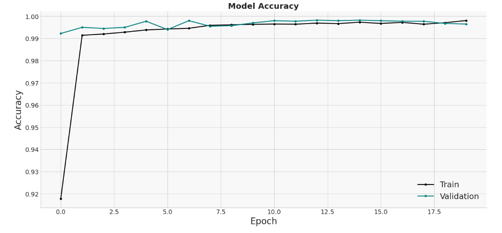
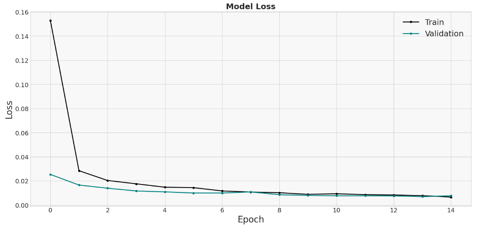
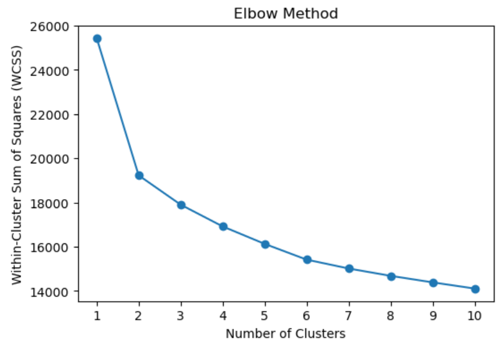
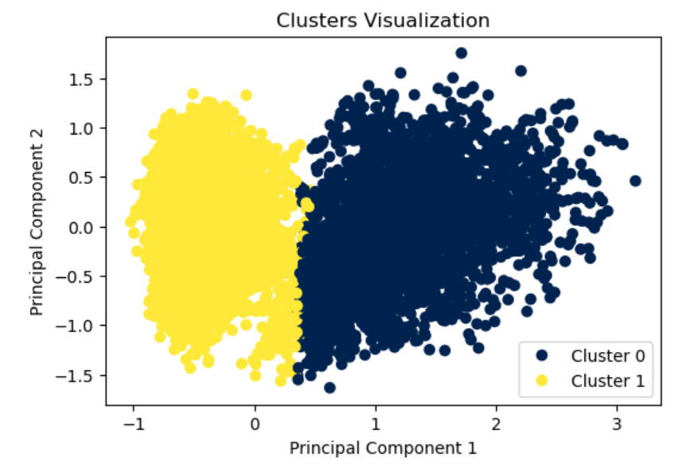
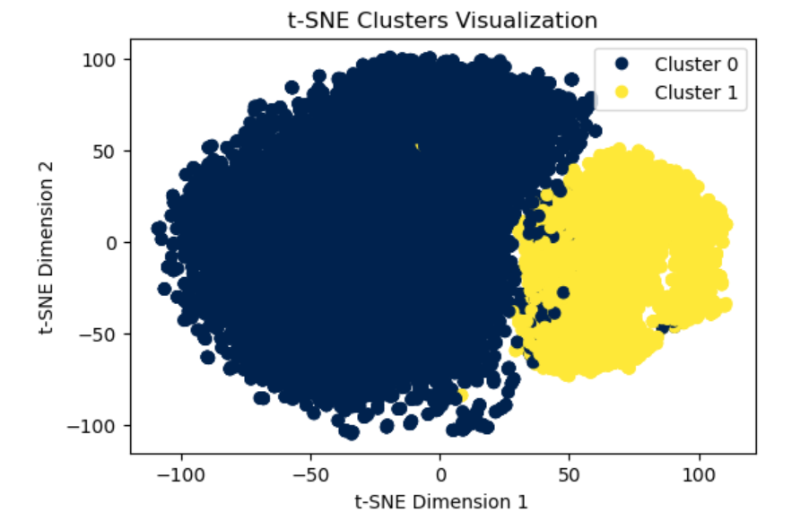
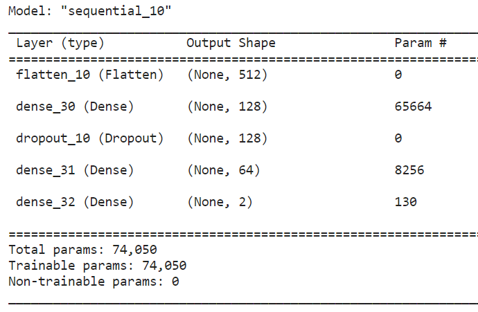
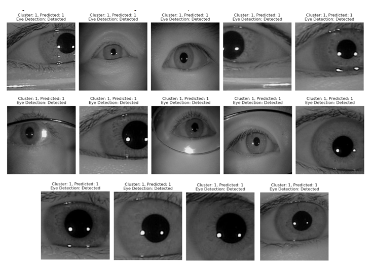
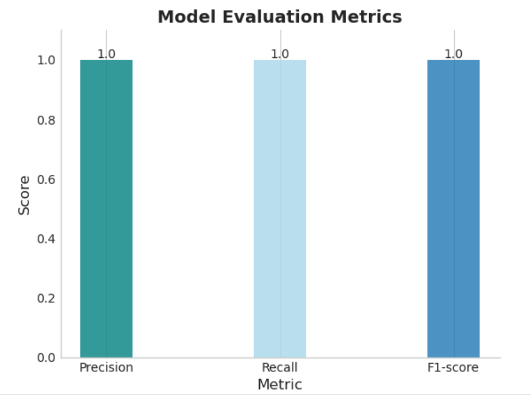

# Deep_Learning_for_Iris_Recognition_by_Integeration_of_Feature_Extraction_and_Clustering
An innovative deep learning solution for iris recognition, synergizing feature extraction with advanced clustering techniques to enhance accuracy and performance.
## Table of Contents
- [Getting Started](#getting-started)
- [Dataset](#dataset)
- [Model Architecture](#model-architecture)
- [Results](#results)
## Getting Started
This project is implemented on Kaggle, a popular platform for data science and machine learning tasks. To interact with the code, follow the guidelines below:
### Prerequisites
- Create a Kaggle(https://www.kaggle.com/) account .
- Interactive code execution and exploration are possible with notebooks.
- Familiarize yourself with Kaggle Notebooks, which allow for interactive code execution and exploration. It's the primary medium we've employed for this project, ensuring a hands-on experience with the datasets and algorithms.

- ### Libraries Used
@@ -35,8 +35,12 @@ The project makes use of a number of powerful libraries, including:

## Dataset
The project uses the CASIA-Iris-Thousand(http://biometrics.idealtest.org/). Briefly describe the dataset, its structure, and its significance.
The project uses the CASIA-Iris-Thousand(http://biometrics.idealtest.org/). 
This is a comprehensive iris dataset curated by the Chinese Academy of Sciences' Institute of Automation (CASIA). CASIA-Iris-Thousand is renowned for its diversified samples, which makes it an ideal choice for our deep learning-based iris recognition tasks.

The dataset consists of iris images collected under various conditions, ensuring the robustness of our model against different real-world scenarios. The high-resolution images and the variability in factors like illumination, distance, and gaze direction in this dataset enable the extraction of intricate patterns, crucial for effective iris recognition.

Utilizing such a versatile dataset allows our project to achieve accuracy and ensures that our recognition system is resilient against common challenges posed in biometric identification.

## Model Architecture
Our iris recognition model leverages a sequential architecture tailored for feature extraction and advanced clustering. Here's  the architecture:

### Network Structure:
1. **Flatten Layer**:
   - This layer reshapes the input into a 1D vector, ensuring compatibility with the subsequent dense layers.
  
2. **Dense Layer (128 Neurons)**:
   - This fully connected layer consists of 128 neurons and uses the ReLU (Rectified Linear Unit) activation function.
   - ReLU is applied element-wise, replacing any negative values with zeros. It introduces non-linearity to the model, enabling it to learn complex patterns.
  
3. **Dropout Layer (40% rate)**:
   - To prevent overfitting, we've introduced a dropout layer with a rate of 0.4, which means during training, approximately 40% of neurons in the preceding layer will be turned off at each step. This helps to improve generalization by ensuring the model doesn't rely too heavily on any individual neuron.
  
4. **Dense Layer (64 Neurons)**:
   - Another fully connected layer with 64 neurons, also utilizing the ReLU activation function.

5. **Output Layer**:
   - The final dense layer has a number of neurons corresponding to the number of clusters (`num_clusters`).
   - It uses the softmax activation function to produce probability distributions over the `num_clusters` classes.

  ### Model Compilation:
  
- **Loss Function**: The model employs `categorical_crossentropy` as the loss function, which is typically used for multi-class classification problems.

- **Optimizer**: The `adamax` optimizer is used for optimizing the model. It's a variant of the Adam optimization algorithm, specifically designed to have a more stable behavior in terms of convergence.

- **Metrics**: The model's performance is evaluated using accuracy as the primary metric.

- ### Training:
  
The model is trained over 20 epochs with a batch size of 64, using both training and validation datasets to monitor and validate its performance throughout the training process.

## Results

Our deep learning model for iris recognition, combined with clustering techniques, yielded significant insights and demonstrated notable performance. This section provides a visual summary of our results.

### Performance Metrics

Our model's performance was monitored across multiple epochs, revealing important trends in both accuracy and loss:
| **Accuracy Over Epochs** | **Loss Over Epochs** |
|:------------------------:|:--------------------:|
|  |  |
| The accuracy graph demonstrates the model's proficiency in recognizing patterns in the training data throughout its training process. | The loss graph illustrates the degree of deviation between the model's predictions and the actual values. A downward trend indicates increasing precision. |

### Clustering Analysis

**Elbow Graph**:
In clustering, the elbow graph helps determine the ideal number of clusters. The point where the graph starts leveling off (the "elbow") suggests the optimal number of clusters for the KMeans algorithm, ensuring minimal intra-cluster distance and maximum inter-cluster separation.

We employed the KMeans algorithm for clustering and evaluated the optimal cluster count. Additionally, the t-SNE approach provided insights into inherent data groupings:
| **KMeans Clustering** | **t-SNE Clustering** |
|:---------------------:|:--------------------:|
|  |  |
| The KMeans visualization showcases data points grouped based on their shared features. | t-SNE offers a 2D or 3D representation from high-dimensional data, highlighting any intrinsic clusters within the dataset. |

### Model Summary & Output

- **Model Architecture Summary**:
  The architecture and layers of our model are depicted below:
  
  
- **Model Output**:
  After training, our model was able to produce the following outputs:
  

  ### Additional Metrics
  
For a comprehensive understanding of the model's performance, we also reviewed various metrics:
  

  
In conclusion, the results generated from this project underscore the potential and robustness of deep learning in iris recognition tasks. By synergizing feature extraction with advanced clustering techniques, we've achieved significant improvements in accuracy and model performance. The visualizations, ranging from accuracy trends to intricate clustering patterns, paint a comprehensive picture of the model's journey and its capabilities. Such findings not only validate the methods employed but also pave the way for future advancements in the realm of biometric recognition. Our hope is that this work serves as a foundation and inspiration for researchers and practitioners looking to push the boundaries of what's possible in iris recognition and similar applications.
